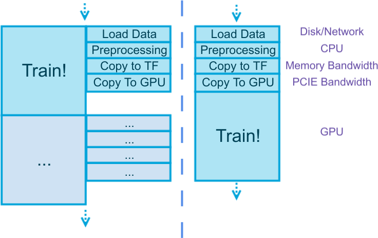

# Input Pipeline

This tutorial contains some general discussions on the topic of
"how to read data efficiently to work with TensorFlow",
and how tensorpack supports these methods.
As a beginner you can skip this tutorial, because these are details under the tensorpack interface,
but knowing it could help understand the efficiency and choose the best input pipeline for your task.

## Prepare Data in Parallel



A common sense no matter what framework you use:
<center>
Prepare data in parallel with the training!
</center>

The reasons are:
1. Data preparation often consumes non-trivial time (depend on the actual problem).
2. Data preparation often uses completely different resources from training (see figure above) --
	doing them together doesn't slow you down. In fact you can further parallelize different stages in
	the preparation since they also use different resources.
3. Data preparation often doesn't depend on the result of the previous training step.

Let's do some simple math: according to [tensorflow/benchmarks](https://www.tensorflow.org/performance/benchmarks),
4 P100 GPUs can train ResNet50 at 852 images/sec, and the size of those images are 852\*224\*224\*3\*4bytes = 489MB.
Assuming you have 5GB/s `memcpy` bandwidth (roughly like this if you run single-thread copy), simply copying the data once would take 0.1s -- slowing
down your training by 10%. Think about how many more copies are made during your preprocessing.

Failure to hide the data preparation latency is the major reason why people
cannot see good GPU utilization. You should __always choose a framework that enables latency hiding.__
However most other TensorFlow wrappers are designed without latency hiding in mind.
Tensorpack has built-in mechanisms to hide latency of the above stages.
This is one of the reasons why tensorpack is [faster](https://github.com/tensorpack/benchmarks).

## Python Reader or TF Reader ?

The above discussion is valid regardless of what you use to load/preprocess data,
either Python code or TensorFlow operators, or a mix of two.
Both are supported in tensorpack, while we recommend using Python.
See more discussions at [Why DataFlow?](../philosophy/dataflow.md)

## InputSource

`InputSource` is an abstract interface used by tensorpack trainers, to describe where the inputs come from and how they enter the graph.
Some choices are:

1. [FeedInput](../../modules/input_source.html#tensorpack.input_source.FeedInput):
	Data come from a DataFlow and get fed to the graph (slow).
2. [QueueInput](../../modules/input_source.html#tensorpack.input_source.QueueInput):
    Data come from a DataFlow and get buffered on CPU by a TF queue.
3. [StagingInput](../../modules/input_source.html#tensorpack.input_source.StagingInput):
	Come from some other `InputSource`, then prefetched on GPU by a TF StagingArea.
4. [TFDatasetInput](../../modules/input_source.html#tensorpack.input_source.TFDatasetInput)
	Come from a `tf.data.Dataset`.
5. [dataflow_to_dataset](../../modules/input_source.html#tensorpack.input_source.TFDatasetInput.dataflow_to_dataset)
	Come from a DataFlow, and then further processed by utilities in `tf.data.Dataset`.
6. [TensorInput](../../modules/input_source.html#tensorpack.input_source.TensorInput):
	Come from some tensors you define (can be reading ops, for example).
7. [ZMQInput](../../modules/input_source.html#tensorpack.input_source.ZMQInput)
	Come from some ZeroMQ pipe, where the reading/preprocessing may happen in a different process or even a different machine.

Typically, we recommend using `DataFlow + QueueInput` as it's good for most use cases.
`QueueInput` and `StagingInput` can help you hide the copy latency to TF and then to GPU.
If your data has to come from a separate process for whatever reasons, use `ZMQInput`.

If you need to use TF reading ops directly, either define a `tf.data.Dataset`
and use `TFDatasetInput`, or use `TensorInput`.

Refer to the documentation of these `InputSource` for more details.

```eval_rst
.. note:: **InputSource requires tensorpack**

    `tensorpack.dataflow` is a pure Python library for efficient data loading which can be used
    independently without TensorFlow or tensorpack trainers.

    However, the `InputSource` interface does require tensorpack and cannot be
    used without tensorpack trainers.
    Without tensorpack trainers, you'll have to optimize the copy latency by yourself.
```
