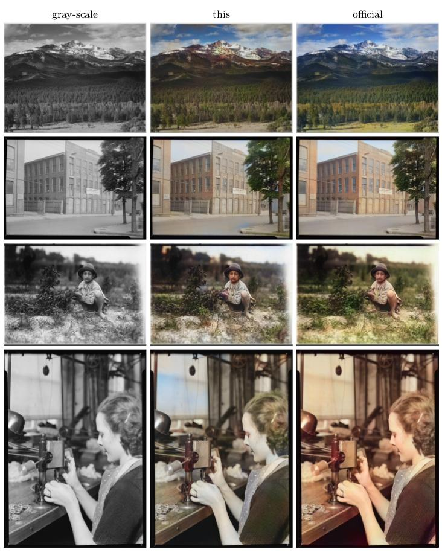
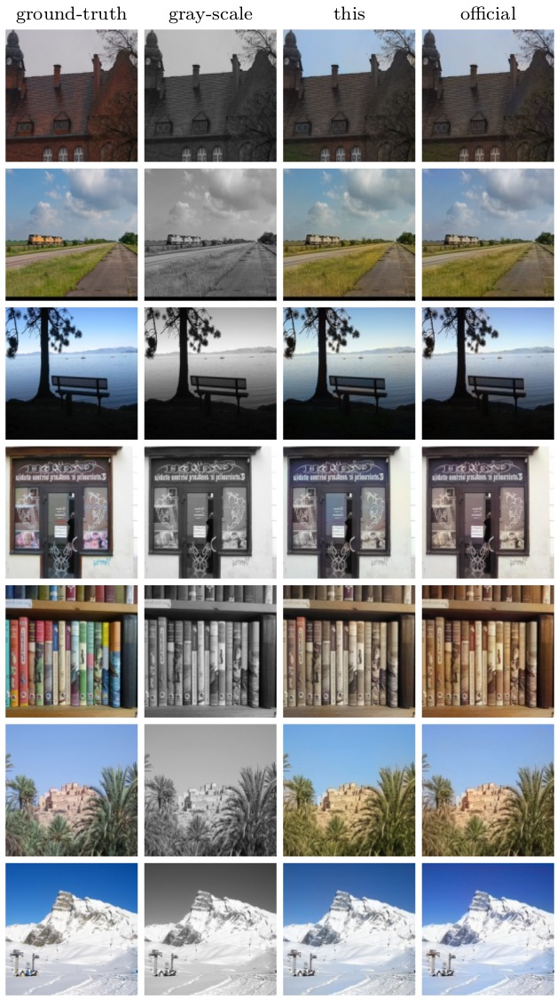
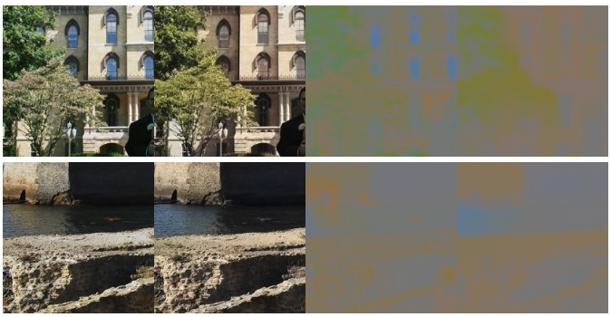

## Let there be color

Reproduce
[Let there be Color!: Joint End-to-end Learning of Global and Local Image Priors
for Automatic Image Colorization with Simultaneous Classification](http://hi.cs.waseda.ac.jp/~iizuka/projects/colorization/en/)
by Iizuka et al.

Given a luminance only image (single channel), the network is trained to hallucinate RGB color information.

<p align="center">  </p>

* Left: old black-and-white photography
* Middle: this implementation (trained for 8 days)
* Right: authors implementation (trained for 21 days, inference: CPU only)

Validation-Set results:
<p align="center">  </p>

### Usage

1. Download [PLACE-205 dataset](http://places.csail.mit.edu/downloadData.html) (not PLACE2) and convert data set

```bash
python place_lmdb_generator.py --tar imagesPlaces205_resize.tar \
                                   --lmdb /data/train_places205.lmdb \
                                   --labels trainvalsplit_places205/train_places205.csv
python place_lmdb_generator.py --tar imagesPlaces205_resize.tar \
                                   --lmdb /data/val_places205.lmdb \
                                   --labels trainvalsplit_places205/val_places205.csv
```

2. Train the network using:

```bash
python let-there-be-color.py --train_lmdb /data/train_places205.lmdb --val_lmdb /data/val_places205.lmdb
```

Training will take a while (authors reports 21 days). Acceptable results should be obtained within 5 epochs.
You can download and play with the pretrained model [here](http://models.tensorpack.com/Colorization/).

During training, Tensorboard should output visualizations of the training-data like

<p align="center">  </p>

Each pair is ground-truth (left) and prediction (right).

3. Inference on an image and output in current directory:

```bash
python let-there-be-color.py --load /path/to/checkpoint --apply path/to/img.png
```

Note, this model has the same [best performance tricks](https://github.com/satoshiiizuka/siggraph2016_colorization) 
as the code for inference released by the authors. To scale the input image to 224x224 use:

```bash
python let-there-be-color.py --load /path/to/checkpoint --apply path/to/img.png --scale 224
```

