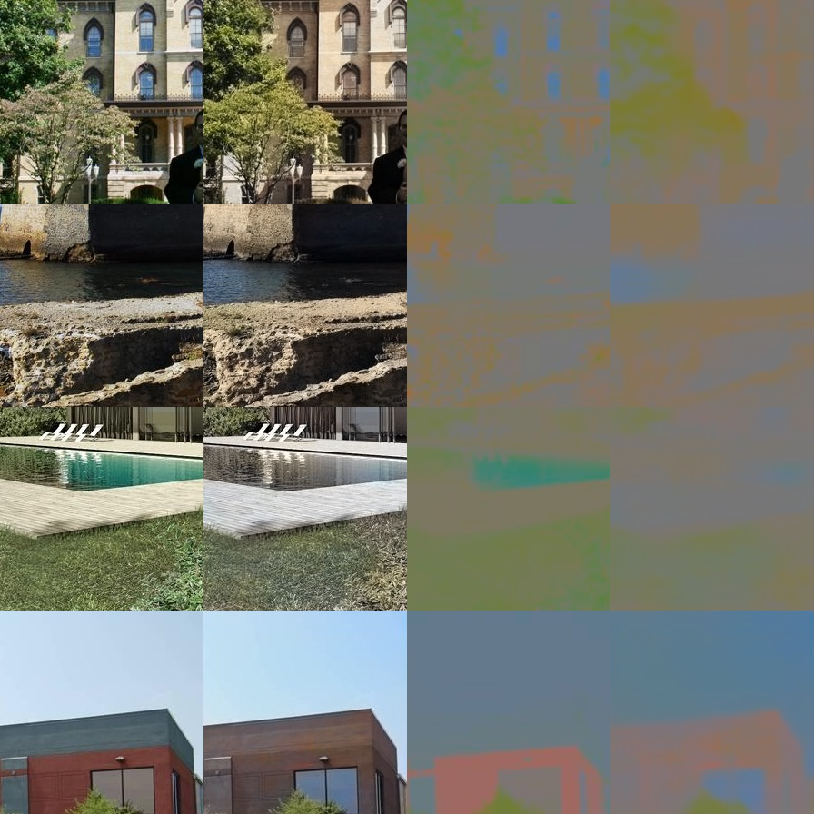

# Let there be color

This example provides a re-implementation of 

Let there be Color!: Joint End-to-end Learning of Global and Local Image Priors
for Automatic Image Colorization with Simultaneous Classification
<http://hi.cs.waseda.ac.jp/~iizuka/projects/colorization/en/>

This contains a few minor modifications compared to the paper:
- we use the new PLACE2 dataset
- we use the `tanh` as an the non-linearity in the final layer

Visualization of ground-truth and predicted RGB/ab.

