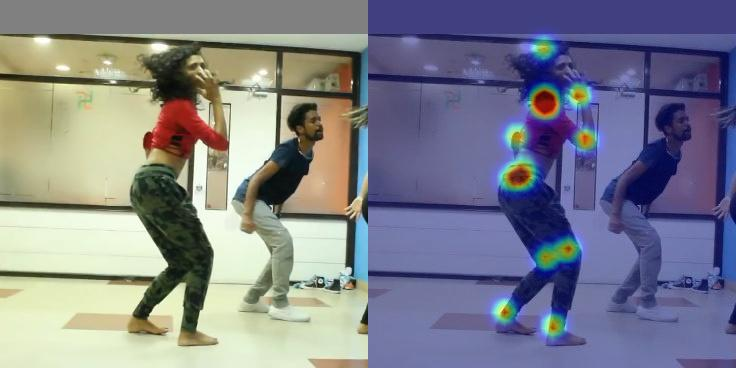

# Convolutional Pose Machines

A script to load and run pre-trained CPM model released by Shih-En. The original code in caffe is [here](https://github.com/shihenw/convolutional-pose-machines-release).
Reference paper: [Convolutional Pose Machines](https://arxiv.org/abs/1602.00134), Shih-En et al., CVPR16.

Also check out [Stereo Pose Machines](https://github.com/ppwwyyxx/Stereo-Pose-Machines), a __real-time__ CPM application based on tensorpack.

## Usage:

Prepare the model:
```
# download the released caffe model:
wget http://pearl.vasc.ri.cmu.edu/caffe_model_github/model/_trained_MPI/pose_iter_320000.caffemodel
wget https://github.com/shihenw/convolutional-pose-machines-release/raw/master/model/_trained_MPI/pose_deploy_resize.prototxt
# convert the model to a dict:
python -m tensorpack.utils.loadcaffe pose_deploy_resize.prototxt pose_iter_320000.caffemodel CPM-original.npy
```

Or you can download the converted model from [model zoo](http://models.tensorpack.com/caffe/).

Run it on an image, and produce `output.jpg`:
```
python load-cpm.py --load CPM-original.npy --input test.jpg
```
Input image will get resized to 368x368. Note that this CPM comes without person detection, so the
person has to be in the center of the image (and not too small).


