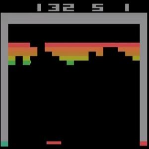
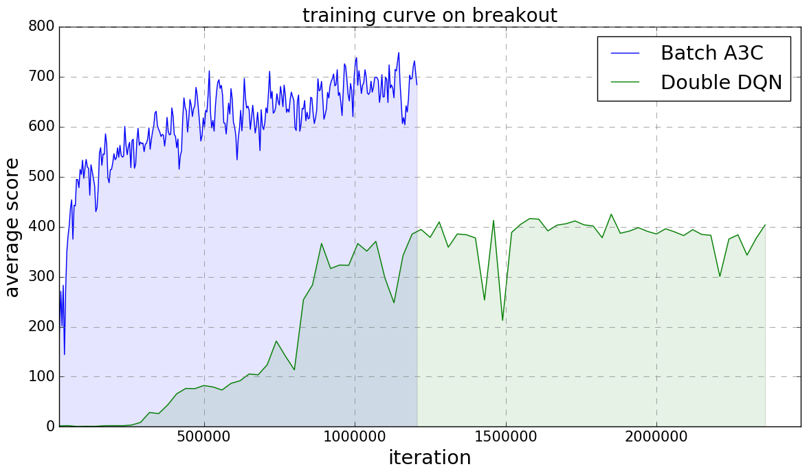

[video demo](https://youtu.be/o21mddZtE5Y)

Reproduce (performance of) the following reinforcement learning methods:

+ Nature-DQN in:
[Human-level Control Through Deep Reinforcement Learning](http://www.nature.com/nature/journal/v518/n7540/full/nature14236.html)

+ Double-DQN in:
[Deep Reinforcement Learning with Double Q-learning](http://arxiv.org/abs/1509.06461)

+ Dueling-DQN in: [Dueling Network Architectures for Deep Reinforcement Learning](https://arxiv.org/abs/1511.06581)

+ A3C in [Asynchronous Methods for Deep Reinforcement Learning](http://arxiv.org/abs/1602.01783). (I
used a modified version where each batch contains transitions from different simulators, which I called "Batch-A3C".)

## Performance & Speed
Claimed performance in the paper can be reproduced, on several games I've tested with.



On one TitanX, Double-DQN took 1 day of training to reach a score of 400 on breakout game.
Batch-A3C implementation only took <2 hours.

Double-DQN with nature paper setting runs at 60 batches (3840 trained frames, 240 seen frames, 960 game frames) per second on (Maxwell) TitanX.

## How to use

Install [ALE](https://github.com/mgbellemare/Arcade-Learning-Environment) and gym.

Download an [atari rom](https://github.com/openai/atari-py/tree/master/atari_py/atari_roms) to
`$TENSORPACK_DATASET/atari_rom/` (defaults to ~/tensorpack_data/atari_rom/), e.g.:
```
mkdir -p ~/tensorpack_data/atari_rom
wget https://github.com/openai/atari-py/raw/master/atari_py/atari_roms/breakout.bin -O ~/tensorpack_data/atari_rom/breakout.bin
```

Start Training:
```
./DQN.py --rom breakout.bin
# use `--algo` to select other DQN algorithms. See `-h` for more options.
```

Watch the agent play:
```
./DQN.py --rom breakout.bin --task play --load path/to/model
```
A pretrained model on breakout can be downloaded [here](http://models.tensorpack.com/DeepQNetwork/).

A3C code and models for Atari games in OpenAI Gym are released in [examples/A3C-Gym](../A3C-Gym)
