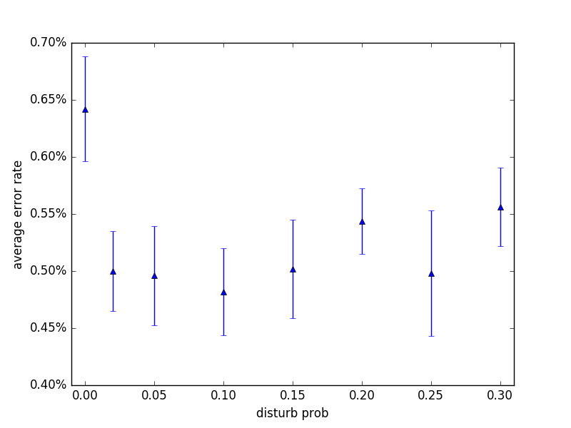
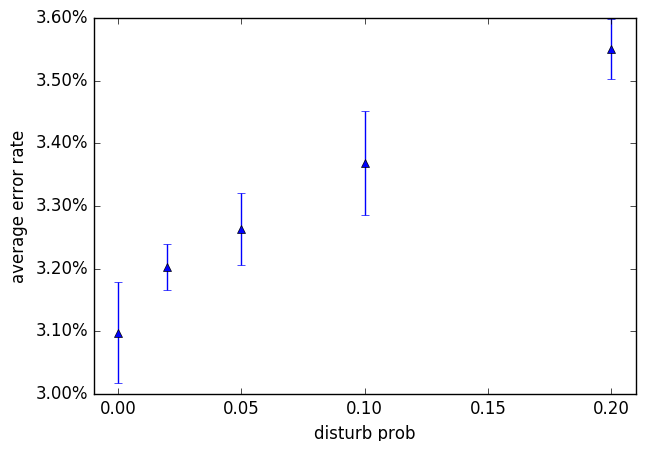

## DisturbLabel

I ran into the paper [DisturbLabel: Regularizing CNN on the Loss Layer](https://arxiv.org/abs/1605.00055) on CVPR16,
which basically said that noisy data gives you better performance.
As many, I didn't believe the method and the results. This code exists to
disprove the results in the paper.

This is a simple mnist training script with DisturbLabel. It uses the simple architecture in the paper, and
hyperparameters in my original [mnist example](../mnist-convnet.py).
The results surprised me, clean labels give the worst accuracy:

Experiements were repeated 15 times for p=0, 10 times for p=0.02 & 0.05, and 5 times for other values
of p. All experiements run for 100 epochs, with lr decay, which are enough for them to converge.

I suppose the disturb method works as a random noise that could prevent SGD from getting stuck, if
training data are too easy to fit or too few.
The method didn't work for slightly harder problems such as SVHN:

The SVHN experiements used the model & hyperparemeters as my original [svhn example](../svhn-digit-convnet.py).
Experiements were all repeated 10 times to get the error bar. It apparently does not work.

It will not work for ImageNet either. There is indeed a terribly weak
ImageNet experiment in this paper, and that's a CVPR paper.
