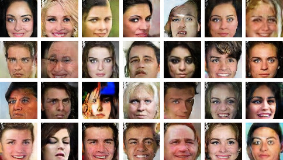

# Generative Adversarial Networks

Reproduce the following GAN-related methods:

+ DCGAN ([Unsupervised Representation Learning with DCGAN](https://arxiv.org/abs/1511.06434))

+ pix2pix ([Image-to-image Translation with Conditional Adversarial Networks](https://arxiv.org/pdf/1611.07004v1.pdf))

+ InfoGAN ([InfoGAN: Interpretable Representation Learning by Information Maximizing GAN](https://arxiv.org/abs/1606.03657))

+ Conditional GAN

+ [Wasserstein GAN](https://arxiv.org/abs/1701.07875)

Please see the __docstring__ in each script for detailed usage.

## DCGAN-CelebA.py

Reproduce DCGAN following the setup in [dcgan.torch](https://github.com/soumith/dcgan.torch).

Play with the [pretrained model](https://drive.google.com/drive/folders/0B9IPQTvr2BBkLUF2M0RXU1NYSkE?usp=sharing) on CelebA face dataset:

+ Generated samples

+ Vector arithmetic: smiling woman - neutral woman + neutral man = smiling man

## Image2Image.py

Image-to-Image following the setup in [pix2pix](https://github.com/phillipi/pix2pix).

For example, with the cityscapes dataset, it learns to generate semantic segmentation map of urban scene:

This is a visualization from tensorboard. Left to right: original, ground truth, model output.

## InfoGAN-mnist.py

Reproduce the mnist experiement in InfoGAN.
It assumes 10 latent variables corresponding to a categorical distribution, 2 latent variables corresponding to a uniform distribution.
It then maximizes mutual information between these latent variables and the image, and learns interpretable latent representation.

* Left: 10 latent variables corresponding to 10 digits.
* Middle: 1 continuous latent variable controlled the rotation.
* Right: another continuous latent variable controlled the thickness.

## ConditionalGAN-mnist.py

Train a simple GAN on mnist, conditioned on the class labels.

## WGAN-CelebA.py

Reproduce WGAN by some small modifications on DCGAN-CelebA.py.
