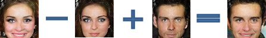
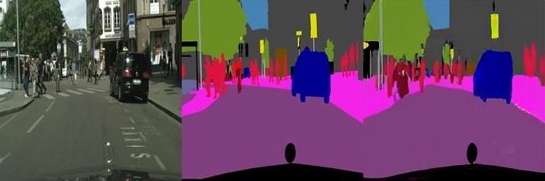
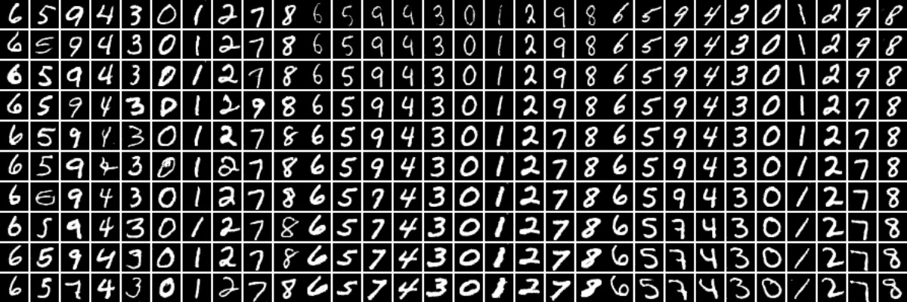
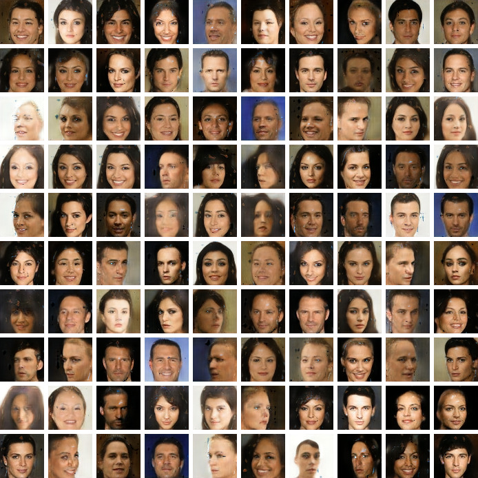
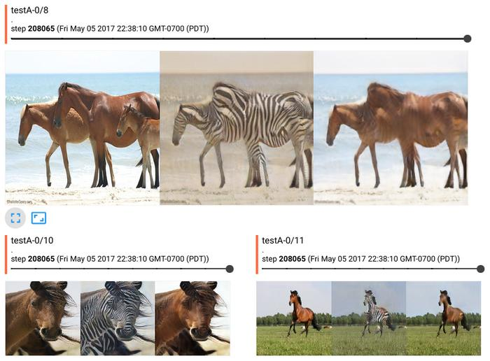

# Generative Adversarial Networks

Reproduce the following GAN-related methods, 100~200 lines each:

+ DCGAN ([Unsupervised Representation Learning with DCGAN](https://arxiv.org/abs/1511.06434))

+ pix2pix ([Image-to-image Translation with Conditional Adversarial Networks](https://arxiv.org/pdf/1611.07004v1.pdf))

+ InfoGAN ([InfoGAN: Interpretable Representation Learning by Information Maximizing GAN](https://arxiv.org/abs/1606.03657))

+ Conditional GAN

+ [Wasserstein GAN](https://arxiv.org/abs/1701.07875)

+ Improved Wasserstein GAN, i.e. WGAN-GP ([Improved Training of Wasserstein GANs](https://arxiv.org/abs/1704.00028))

+ DiscoGAN ([Learning to Discover Cross-Domain Relations with Generative Adversarial Networks](https://arxiv.org/abs/1703.05192))

+ BEGAN ([BEGAN: Boundary Equilibrium Generative Adversarial Networks](https://arxiv.org/abs/1703.10717))

+ CycleGAN ([Unpaired Image-to-Image Translation using Cycle-Consistent Adversarial Networks](https://arxiv.org/abs/1703.10593))

Please see the __docstring__ in each script for detailed usage and pretrained models. MultiGPU training is supported.

## [DCGAN.py](DCGAN.py)

Reproduce DCGAN following the setup in [dcgan.torch](https://github.com/soumith/dcgan.torch).

+ Generated samples

+ Vector arithmetic: smiling woman - neutral woman + neutral man = smiling man

## [Image2Image.py](Image2Image.py)

Image-to-Image translation following the setup in [pix2pix](https://github.com/phillipi/pix2pix).

For example, with the cityscapes dataset, it learns to generate semantic segmentation map of urban scene:

This is a visualization from tensorboard. Left to right: original, ground truth, model output.

## [InfoGAN-mnist.py](InfoGAN-mnist.py)

Reproduce the mnist experiement in InfoGAN.
It assumes 10 latent variables corresponding to a categorical distribution, 2 latent variables corresponding to a uniform distribution.
It then maximizes mutual information between these latent variables and the image, and learns interpretable latent representation.

* Left: 10 latent variables corresponding to 10 digits.
* Middle: 1 continuous latent variable controlled the rotation.
* Right: another continuous latent variable controlled the thickness.

## [ConditionalGAN-mnist.py](ConditionalGAN-mnist.py)

Train a simple GAN on mnist, conditioned on the class labels.

## [WGAN.py](WGAN.py), [Improved-WGAN.py](Improved-WGAN.py), [BEGAN.py](BEGAN.py)

These variants are implemented by some small modifications on top of DCGAN.py.
Some BEGAN samples:

## [CycleGAN.py](CycleGAN.py), [DiscoGAN-CelebA.py](DiscoGAN-CelebA.py)

Reproduce CycleGAN with the original datasets, and DiscoGAN on CelebA. They are pretty much the same idea with different architecture.
CycleGAN horse-to-zebra in tensorboard:

