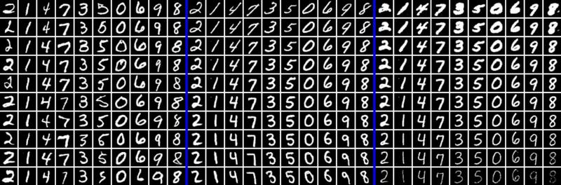

# Generative Adversarial Networks

Reproduce the following GAN-related papers:

+ Unsupervised Representation Learning with DCGAN. [paper](https://arxiv.org/abs/1511.06434)

+ Image-to-image Translation with Conditional Adversarial Networks. [paper](https://arxiv.org/pdf/1611.07004v1.pdf)

+ InfoGAN: Interpretable Representation Learning by Information Maximizing GAN. [paper](https://arxiv.org/abs/1606.03657)

Detailed usage is in the docstring of each script.

## DCGAN-CelebA.py

Reproduce DCGAN following the setup in [dcgan.torch](https://github.com/soumith/dcgan.torch).

Play with the [pretrained model](https://drive.google.com/drive/folders/0B9IPQTvr2BBkLUF2M0RXU1NYSkE?usp=sharing) on CelebA face dataset:

+ Generated samples

+ Vector arithmetic: smiling woman - neutral woman + neutral man = smiling man

## Image2Image.py

Image-to-Image following the setup in [pix2pix](https://github.com/phillipi/pix2pix).
It requires the datasets released by the original authors.

For example, with the cityscapes dataset, it learns to generate semantic segmentation map of urban scene:

This is a visualization from tensorboard. Left to right: original, ground truth, model output.

## InfoGAN-mnist.py

Reproduce one mnist experiement in InfoGAN.
By assuming 10 latent variables corresponding to a categorical distribution and maximizing mutual information,
the network learns to map the 10 variables to 10 digits in a completely unsupervised way.

