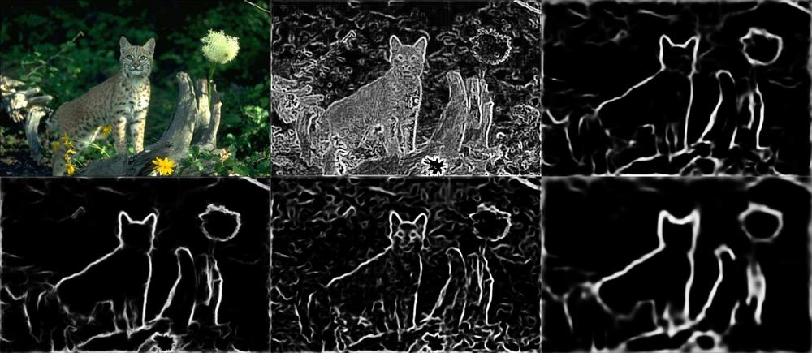

## Holistically-Nested Edge Detection

Reproduce the HED paper by Saining. See [https://arxiv.org/abs/1504.06375](https://arxiv.org/abs/1504.06375).



(Bottom-left: raw fused heatmap; Middle and right column: raw heatmaps at different stages)

HED is a fully-convolutional architecture. This code generally would also work
for other FCN tasks such as semantic segmentation and detection.

## Usage

This script needs the original BSDS dataset and applies augmentation on the fly.
It will automatically download the dataset to `$TENSORPACK_DATASET/` if not there.

It requires pretrained vgg16 model. See the docs in [examples/CaffeModels](../CaffeModels)
for instructions to convert from vgg16 caffe model.

To view augmented training images:
```bash
./hed.py --view
```

To start training:
```bash
./hed.py --load vgg16.npz
```
It takes about 100k steps (~10 hours on a TitanX) to reach a reasonable performance.

To inference (produce a heatmap at each level at out*.png):
```bash
./hed.py --load pretrained.model --run a.jpg
```
Models I trained can be downloaded [here](http://models.tensorpack.com/HED/).
