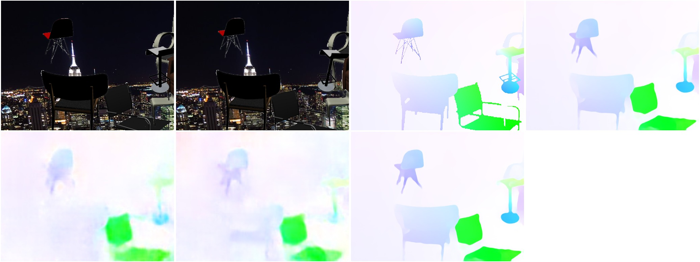

## OpticalFlow - FlowNet2

Load and run the pre-trained model in
[FlowNet 2.0: Evolution of Optical Flow Estimation with Deep Networks](https://arxiv.org/abs/1612.01925)
by Ilg et al.

Given two images, the network is trained to predict the optical flow between these images.

<p align="center">  </p>

* Top: both input images from Flying Chairs, ground-truth, original FlowNet2 results (Caffe)
* Bottom: Converted FlowNet2-C, FlowNet2-S, FlowNet2 results (this implementation)

| Model     | AEE (sintel clean) |
| ------    | ------             |
| FlowNet-S | 3.82               |
| FlowNet-C | 3.08               |
| FlowNet2  | 2.10               |

The authors report the AEE of *2.03* (Caffe Model) on Sintel-clean and our implementation gives an AEE of *2.10*,
which is better than other TensorFlow implementations.


### Usage

1. Download the pre-trained model (converted from caffe):

```bash
wget http://models.tensorpack.com/OpticalFlow/flownet2.npz
wget http://models.tensorpack.com/OpticalFlow/flownet2-s.npz
wget http://models.tensorpack.com/OpticalFlow/flownet2-c.npz
```

*Note:* You are required to accept the [author's license](https://github.com/lmb-freiburg/flownet2#license-and-citation) to use these weights.

2. Run inference

```bash
python flownet2.py \
	--left left.png --right right.png \
	--load flownet2.npz --model flownet2
```

3. Evaluate AEE (Average Endpoing Error) on Sintel dataset:

```
wget http://files.is.tue.mpg.de/sintel/MPI-Sintel-complete.zip
unzip MPI-Sintel-complete.zip
python flownet2.py --load flownet2.npz --model flownet2 --sintel_path /path/to/Sintel/training
```
