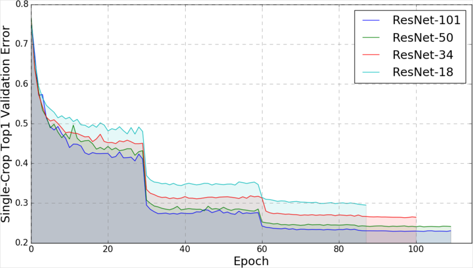
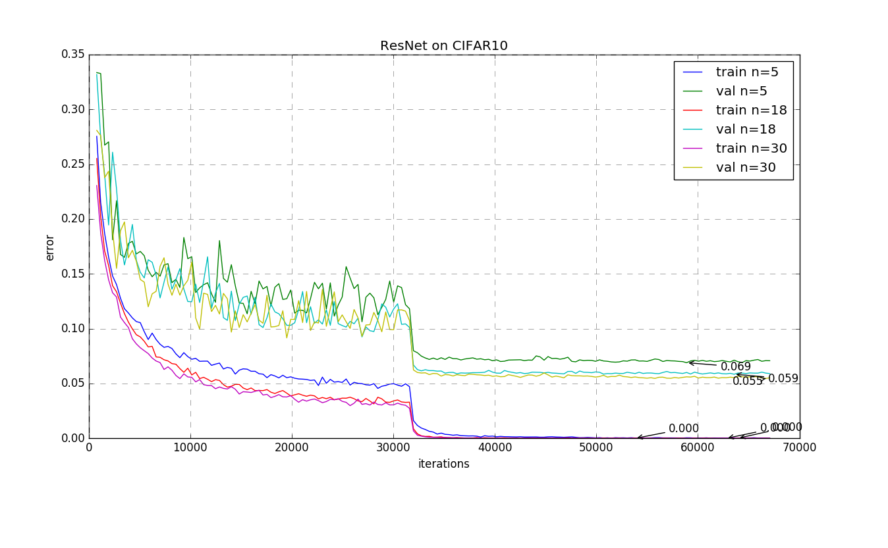

## [imagenet-resnet.py](imagenet-resnet.py)

__Training__ code of three variants of ResNet on ImageNet:

* [Original ResNet](https://arxiv.org/abs/1512.03385)
* [Pre-activation ResNet](https://arxiv.org/abs/1603.05027)
* [Squeeze-and-Excitation ResNet](https://arxiv.org/abs/1709.01507)

The training mostly follows the setup in [fb.resnet.torch](https://github.com/facebook/fb.resnet.torch)
and gets similar performance (with much fewer lines of code).
Models can be [downloaded here](http://models.tensorpack.com/ResNet/).

| Model              | Top 5 Error | Top 1 Error |
|:-------------------|-------------|------------:|
| ResNet18           |     10.50%  |      29.66% |
| ResNet34					 |     8.56%   |      26.17% |
| ResNet50           |     6.85%   |      23.61% |
| ResNet50-SE				 |     6.24%   |      22.64% |
| ResNet101      		 |     6.04%   |      21.95% |
| ResNet152      		 |     5.78%   |      21.51% |

To train, first decompress ImageNet data into [this structure](http://tensorpack.readthedocs.io/en/latest/modules/dataflow.dataset.html#tensorpack.dataflow.dataset.ILSVRC12), then:
```bash
./imagenet-resnet.py --data /path/to/original/ILSVRC --gpu 0,1,2,3 -d 50 [--mode resnet/preact/se]
```

You should be able to see good GPU utilization (95%~99%), if your data is fast enough.
It can finish training [within 20 hours](http://dawn.cs.stanford.edu/benchmark/ImageNet/train.html) on AWS p3.16xlarge.

The default data pipeline is probably OK for machines with SSD & 20 CPU cores.
See the [tutorial](http://tensorpack.readthedocs.io/en/latest/tutorial/efficient-dataflow.html) on other options to speed up your data.



## [load-resnet.py](load-resnet.py)

This script only converts and runs ImageNet-ResNet{50,101,152} Caffe models [released by MSRA](https://github.com/KaimingHe/deep-residual-networks).
Note that the architecture is different from the `imagenet-resnet.py` script and the models are not compatible.

Usage:
```bash
# download and convert caffe model to npz format
python -m tensorpack.utils.loadcaffe PATH/TO/{ResNet-101-deploy.prototxt,ResNet-101-model.caffemodel} ResNet101.npz
# run on an image
./load-resnet.py --load ResNet-101.npz --input cat.jpg --depth 101
```

The converted models are verified on ILSVRC12 validation set.
The per-pixel mean used here is slightly different from the original.

| Model              | Top 5 Error | Top 1 Error |
|:-------------------|-------------|------------:|
| ResNet 50          |      7.78%  |      24.77% |
| ResNet 101         |      7.11%  |      23.54% |
| ResNet 152         |      6.71%  |      23.21% |

## [cifar10-resnet.py](cifar10-resnet.py)

Reproduce pre-activation ResNet on CIFAR10.



Also see a [DenseNet implementation](https://github.com/YixuanLi/densenet-tensorflow) of the paper [Densely Connected Convolutional Networks](https://arxiv.org/abs/1608.06993).


## [cifar10-preact18-mixup.py](cifar10-preact18-mixup.py)

Reproduce the mixup pre-act ResNet-18 CIFAR10 experiment, in the paper:

* [mixup: Beyond Empirical Risk Minimization](https://arxiv.org/abs/1710.09412).

This implementation follows exact settings from the [author's code](https://github.com/hongyi-zhang/mixup).
Note that the architecture is different from the offcial preact-ResNet18.

Usage:
```bash
./cifar10-preact18-mixup.py  # train without mixup
./cifar10-preact18-mixup.py --mixup	 # with mixup
```

Results of the reference code can be reproduced.
In one run it gives me: 5.48% without mixup; __4.17%__ with mixup (alpha=1).
