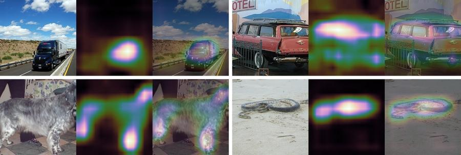

## Visualize Saliency Maps & Class Activation Maps

Implement the Guided-ReLU visualization used in the paper:

* [Striving for Simplicity: The All Convolutional Net](https://arxiv.org/abs/1412.6806)

And the class activation mapping (CAM) visualization proposed in the paper:

* [Learning Deep Features for Discriminative Localization](http://cnnlocalization.csail.mit.edu/)


## Saliency Maps
`saliency-maps.py` takes an image, and produce its saliency map by running a ResNet-50 and backprop its maximum
activations back to the input image space.
Similar techinques can be used to visualize the concept learned by each filter in the network.

Usage:
````bash
wget http://download.tensorflow.org/models/resnet_v1_50_2016_08_28.tar.gz
tar -xzvf resnet_v1_50_2016_08_28.tar.gz
./saliency-maps.py cat.jpg
````

<p align="center">  </p>

Left to right:
+ the original cat image
+ the magnitude in the saliency map
+ the magnitude blended with the original image
+ positive correlated pixels (keep original color)
+ negative correlated pixels (keep original color)

## CAM
`CAM-resnet.py` fine-tune a Preact-ResNet to have 2x larger last-layer feature maps, then produce CAM visualizations.

Usage:
1. Fine tune or retrain the ResNet:
```bash
./CAM-resnet.py --data /path/to/imagenet [--load ImageNet-ResNet18-Preact.npz] [--gpu 0,1,2,3]
```
Pretrained and fine-tuned ResNet can be downloaded
in the [model zoo](http://models.tensorpack.com/).

2. Generate CAM on ImageNet validation set:
```bash
./CAM-resnet.py --data /path/to/imagenet --load ImageNet-ResNet18-Preact-2xGAP.npz --cam
```

<p align="center">  </p>
