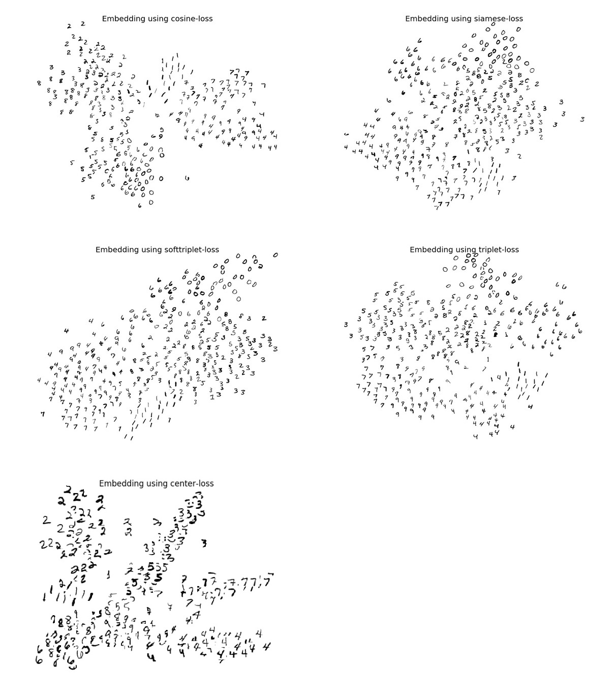

Various Embeddings
==================

Reproduce some embedding methods on MNIST:
* Siamese loss in the paper [Learning a Similarity Metric Discriminatively, with Application to Face
Verification](http://yann.lecun.com/exdb/publis/pdf/chopra-05.pdf).
* Cosine loss
* Triplet loss in the paper [FaceNet: A Unified Embedding for Face Recognition and Clustering](https://arxiv.org/abs/1503.03832)
* Softmax triplet loss in the paper [Deep Metric Learning using Triplet Network](https://arxiv.org/abs/1412.6622)
* Center loss in the paper [A Discriminative Feature Learning Approach for Deep Face Recognition](http://ydwen.github.io/papers/WenECCV16.pdf)


## Usage:
```
# to train:
./mnist-embeddings.py --algorithm [siamese/cosine/triplet/softtriplet/center]
# to visualize:
./mnist-embeddings.py --algorithm [siamese/cosine/triplet/softtriplet/center] --visualize --load train_log/mnist-embeddings/checkpoint
```

<p align="center">  </p>
