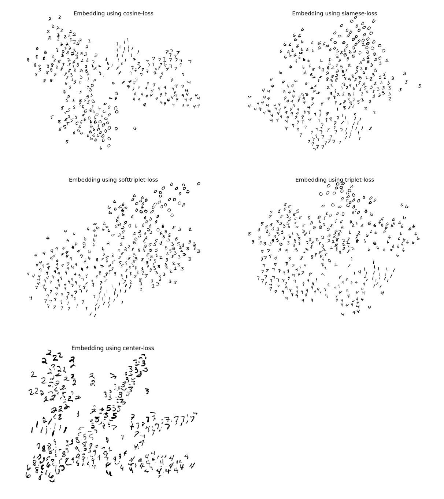

Various Embeddings
==================

Reproduce some results of embedding methods on MNIST.

###Siamese Loss
Learning a Similarity Metric Discriminatively, with Application to Face
Verification. *Chopra et al.* [paper](http://yann.lecun.com/exdb/publis/pdf/chopra-05.pdf)

    python mnist-embeddings.py
    python mnist-embeddings.py --load train_log/mnist-embeddings/checkpoint --visualize

###Cosine - Loss

    python mnist-embeddings.py --algorithm cosine
    python mnist-embeddings.py --algorithm cosine --load train_log/mnist-embeddings/checkpoint --visualize

###Triplet - Loss
Deep Metric Learning using Triplet Network. *Hoffer et al.* [paper](https://arxiv.org/pdf/1412.6622.pdf)

    python mnist-embeddings.py --algorithm triplet
    python mnist-embeddings.py --load train_log/mnist-embeddings/checkpoint --visualize --algorithm triplet

###Softmax-Triplet - Loss

    python mnist-embeddings.py --algorithm softtriplet
    python mnist-embeddings.py --algorithm softtriplet --load train_log/mnist-embeddings/checkpoint --visualize

  

