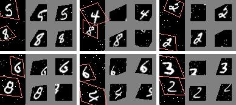

## Spatial Transformer Networks

Reproduce the "MNIST addition" experiments in
[Spatial Transformer Networks](https://arxiv.org/abs/1506.02025)
by Max Jaderberg, et al.

Given an image of two distorted MNIST digits stacked in two channels, the network is trained to
produce the sum of them.
Here the two Spatial Transformer branches learn to localize the two digits
and warped them separately.

<p align="center">  </p>

* Left: input image.
* Middle: output of the first STN branch (which localizes the second digit).
* Right: output of the second STN branch.

To train (takes about 300 epochs to reach 8.8% error):
```bash
./mnist-addition.py
```

To draw the above visualization with [pretrained model](http://models.tensorpack.com/SpatialTransformer/):
```bash
./mnist-addition.py --load mnist-addition.npz --view
```
