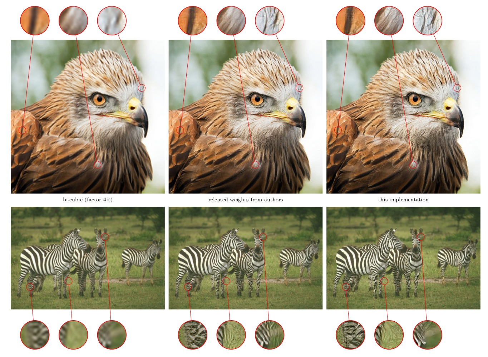

## SuperResolution - EnhanceNet

Reproduce
[EnhanceNet: Single Image Super-Resolution Through Automated Texture Synthesis](https://arxiv.org/abs/1612.07919)
by Sajjadi et al.

Given an low-resolution image, the network is trained to
produce a 4x resolution image using different loss functions.

<p align="center">  </p>

* Left: input image (upscaled with bi-cubic interpolation).
* Middle: using the implementation of the author (**only** contains the generator)
* Right: this implementation (with training code)


### Usage

1. Download MS COCO dataset & VGG19 converted from caffe model zoo:

```bash
wget http://images.cocodataset.org/zips/train2017.zip
python data_sampler.py --lmdb train2017.lmdb --input train2017.zip --create

wget http://models.tensorpack.com/caffe/vgg19.npy
```

2. Train an EnhanceNet-PAT using:

```bash
python enet-pat.py --vgg19 /path/to/vgg19.npy --lmdb train2017.lmdb
```

Training is highly unstable and does not often give results as good as the pretrained model.
You can download and play with the pretrained model [here](http://models.tensorpack.com/SuperResolution/).

3. Inference on an image and output in current directory:

```bash
python enet-pat.py --apply --load /path/to/model --lowres input.png
```

