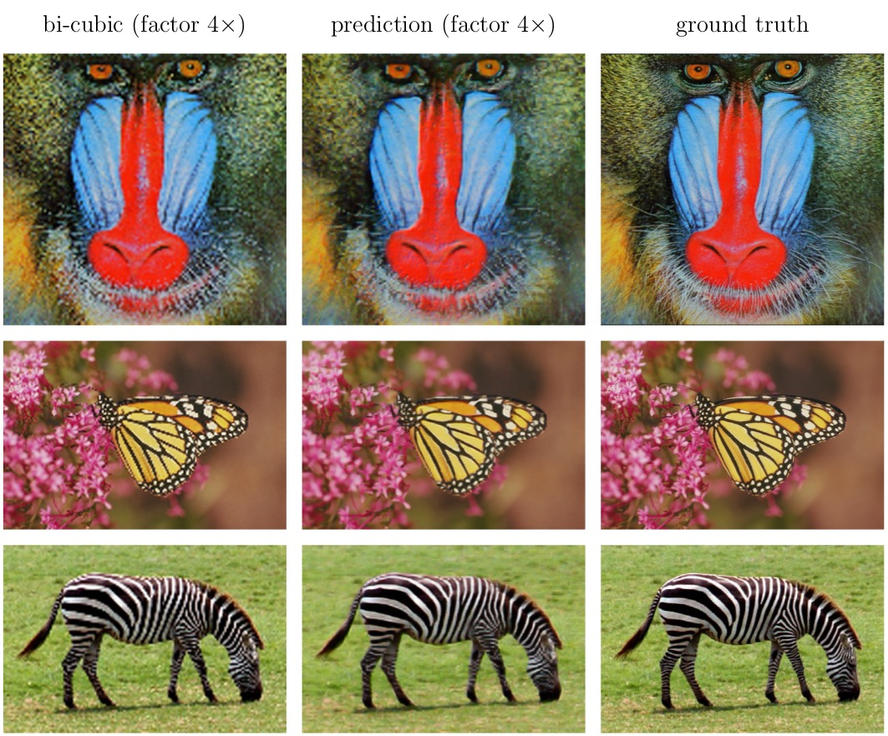

## Superresolution


Network from
[Real-Time Single Image and Video Super-Resolution Using an Efficient Sub-Pixel Convolutional Neural Network](https://arxiv.org/abs/1609.05158)
by Wenzhe Shi, et al.

For evaluation you might download the datasets from:
https://github.com/jbhuang0604/SelfExSR

To evaluate against ground-truth:
````
python super-resolution.py --gpu 0 --load train_log/super-resolution/checkpoint --lowres "Set14/image_SRF_3/img_001_SRF_3_LR.png" --highres "Set14/image_SRF_3/img_001_SRF_3_HR.png"
````

To simply apply the network:
````
python super-resolution.py --gpu 0 --load train_log/super-resolution/checkpoint --lowres "Set14/image_SRF_3/img_001_SRF_3_LR.png" --output "pred-highres.jpg"
````


Training on ImageNet gives the following results (bicubic, ground-truth, network):
<p align="center">  </p>

with the following PSNR values:

| Example       | PSNR (paper)  | PSNR (re-implementation) |
| ------------- | ------------- | ------------------------ |
| Set14/SRF3/1  | 23.72db       | 20.83db                  |
| Set14/SRF3/5  | 24.82db       | 21.48db                  |
| Set14/SRF3/11 | 33.66db       | 28.47db                  |

