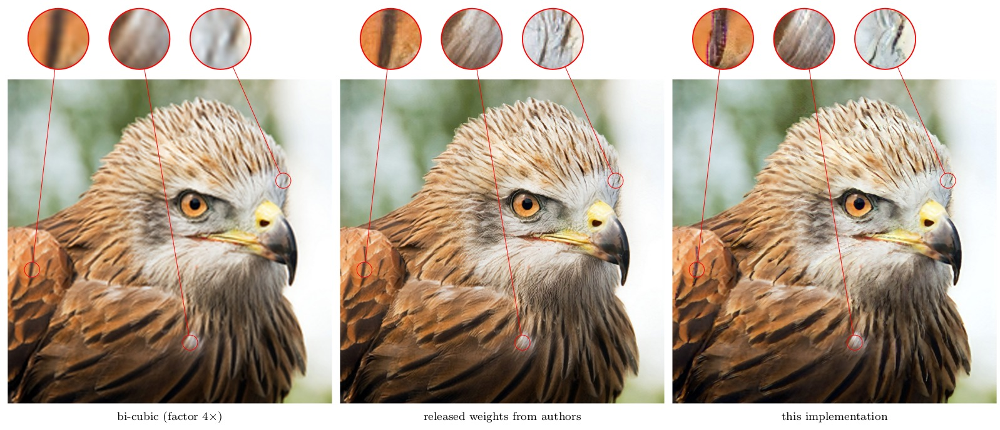

## Superresolution

This further illustrates training on MS COCO and running inference on arbitrary image files.
To train download MS COCO dataset

```bash
DBDIR=/datasets/mscoco/
cd ${DBDIR}
wget http://images.cocodataset.org/zips/train2017.zip
wget http://images.cocodataset.org/zips/val2017.zip
python data_sampler.py --lmdb val2017.lmdb --input val2017.zip --create
python data_sampler.py --lmdb train2017.lmdb --input train2017.zip --create
```


### EnhanceNet

Reproduce the "EnhanceNet: Single Image Super-Resolution Through Automated Texture Synthesis" experiments in
<https://arxiv.org/abs/1612.07919>
by Sajjadi et al. 

Given an low-resolution image, the network is trained to
produce an high resolution image using different loss functions.

<p align="center">  </p>

* Left: input image (upscaled with bi-cubic interpolation).
* Middle: using the implementation of the author (does **only** contain the generator)
* Right: this implementation (with training code)


and then train the model using

```bash
python enet-pat.py --vgg19 /path/to/vgg19.npy --gpu 0,1 --lmdb train2017.lmdb
```

Inference can be done by

```bash
python enet-pat.py --apply --load /checkpoints/checkpoint --lowres "eagle.png" --output "eagle" --gpu 1
```

