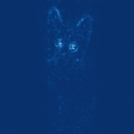
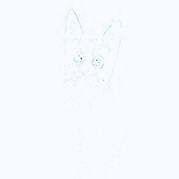
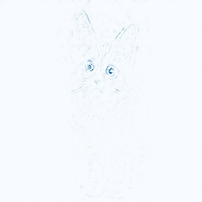
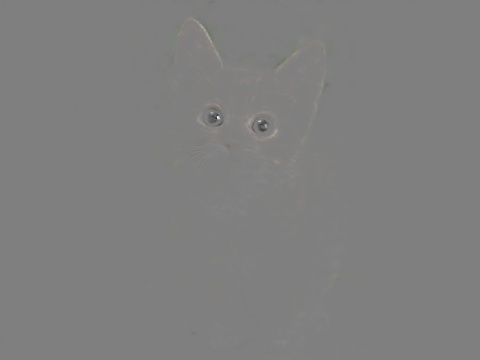

## Visualize Saliency Maps

Implement the Guided-ReLU visualization used in the paper:

* [Striving for Simplicity: The All Convolutional Net](https://arxiv.org/abs/1412.6806)

`saliency-maps.py` takes an image, and produce its saliency map by running a ResNet-50 and backprop its maximum
activation back to the input image space.

Usage:
````bash
wget http://download.tensorflow.org/models/resnet_v1_50_2016_08_28.tar.gz
tar -xzvf resnet_v1_50_2016_08_28.tar.gz
./saliency-maps.py cat.jpg
````

will give you the compute saliency using guided ReLU:

absolute saliency
<p align="center">  </p>
positive saliency
<p align="center">  </p>
negative saliency
<p align="center">  </p>

More visualizations are

Highlight image-parts with high saliency:
<p align="center">  </p>

Convert any intensity information to heatmap:
<p align="center">  </p>
